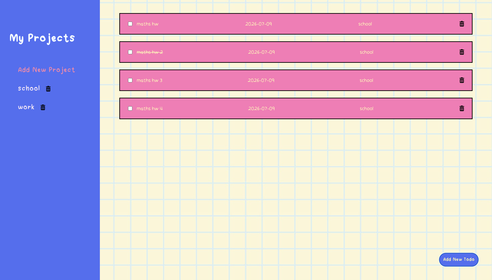

# Todo-List

## Desktop View:

---
## Demo:
https://github.com/user-attachments/assets/f7b925a3-8c3b-4779-b5cc-3d0cc9eef68d
---
## Features: 
- Create Projects and Todos
- Switch between projects
- Display todos inside each project
- Checklist
- Delete Projects and Todos
- Save data using LocalStorage

## New things I learned from this project:
- State Management
- Modules and Application Architecture 
- JSON and Local Storage
- OOP Principles
- Event Delegation
- SOLID Design Principles

## Future Enhancements:
- I want to add a way to list the todos by due dates (using date fns)

## Disclaimer:
The background image used in this project were sourced from Pinterest and are the property of their respective owners. This project is non commercial and intended for personal/educational use only.
